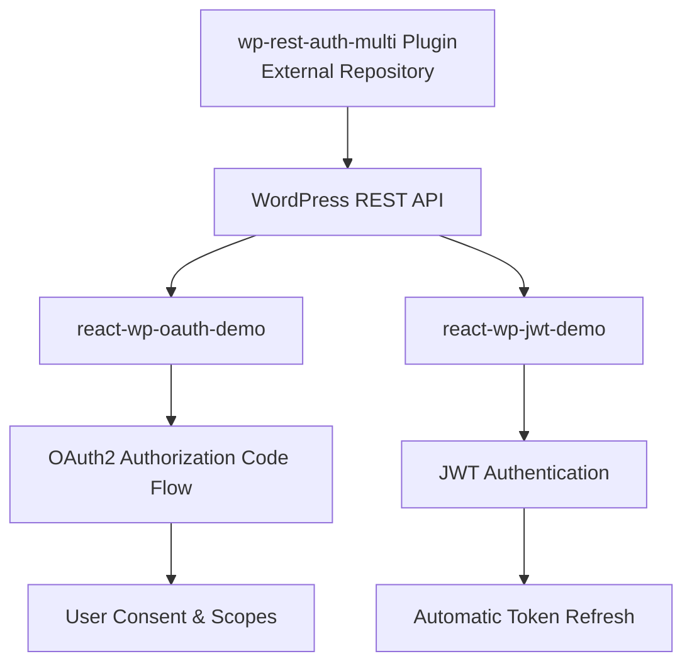

# WordPress REST API Authentication Demos

This repository contains React demo applications that demonstrate different authentication methods with WordPress REST API:

1. **react-wp-oauth-demo** - React demo showcasing OAuth2 Authorization Code flow
2. **react-wp-jwt-demo** - React demo showcasing JWT authentication with production deployment

> **📦 Required Plugin:** These demos work with the [wp-rest-auth-multi](https://github.com/juanma-wp/wp-rest-auth-multi) WordPress plugin (separate repository).

## 🔧 Prerequisites

- **WordPress Installation** (local or remote server)
- **Node.js** (v16 or higher)
- **npm** or **yarn**
- **Local Development Server** (MAMP, XAMPP, or similar for local WordPress)

## 📁 Project Structure

```
wcg2025-demos/
├── react-wp-oauth-demo/         # OAuth2 Demo App
├── react-wp-jwt-demo/           # JWT Demo App
└── README.md                    # This file
```

## 🔌 WordPress Plugin Required

These demos require the **[wp-rest-auth-multi](https://github.com/juanma-wp/wp-rest-auth-multi)** WordPress plugin to function properly.

### Plugin Features

- **JWT Authentication** with access/refresh token support
- **OAuth2 Authorization Code Flow** with PKCE
- **Scope-based permissions** (read, write, delete, upload_files, etc.)
- **User consent screens** with WordPress-styled UI
- **Comprehensive security** with proper token validation
- **CORS support** for React applications

### Quick Setup

1. Install the plugin from: https://github.com/juanma-wp/wp-rest-auth-multi
2. Activate it in WordPress admin
3. Configure JWT secret and OAuth2 clients
4. Set up the React demos below

---

## 🚀 1. OAuth2 Demo: `react-wp-oauth-demo`

A complete React application demonstrating OAuth2 Authorization Code flow with WordPress, featuring interactive API testing and scope-based permissions.

### Features

- **OAuth2 Authorization Code Flow** with PKCE security
- **Interactive Permission Selection** - choose which scopes to request
- **Real-time API Testing** - test different WordPress REST API endpoints
- **Permission Enforcement Demo** - see how OAuth2 scopes are enforced
- **WordPress-styled Consent Screen** - user-friendly permission approval
- **Comprehensive Error Handling** - detailed OAuth2 error messages

### Setup

1. Navigate to the project directory:
   ```bash
   cd react-wp-oauth-demo
   ```

2. Install dependencies:
   ```bash
   npm install
   ```

3. Configure environment variables:
   ```bash
   cp .env.example .env
   ```

   Edit `.env` with your WordPress site details:
   ```env
   VITE_WP_BASE_URL=http://your-wordpress-site.com
   VITE_OAUTH_CLIENT_ID=your-client-id
   VITE_DEBUG=true
   ```

4. Start the development server:
   ```bash
   npm run dev
   ```

5. Open your browser to `http://localhost:5175`

### Usage Flow

1. **Select Permissions** - Choose which OAuth2 scopes to request
2. **Connect to WordPress** - Redirects to WordPress for authentication
3. **Grant Permissions** - User approves or denies requested scopes
4. **Test API Endpoints** - Try different actions with granted permissions
5. **See Security in Action** - Actions without proper scopes are blocked

### Available Scopes

- `read` - View posts, pages, and profile information
- `write` - Create and edit posts and pages
- `delete` - Delete posts and pages
- `upload_files` - Upload and manage media files
- `moderate_comments` - Moderate and manage comments
- `manage_categories` - Create and manage categories and tags

---

## 🔐 2. JWT Demo: `react-wp-jwt-demo`

A React application demonstrating JWT authentication with WordPress, including production deployment capabilities.

### Features

- **JWT Authentication** with access and refresh tokens
- **Automatic Token Refresh** - seamless background token renewal
- **Production Ready** - includes deployment configurations
- **Silent Login** - maintains authentication across browser sessions
- **Secure Cookie Handling** - HTTP-only cookies for refresh tokens

### Setup

1. Navigate to the project directory:
   ```bash
   cd react-wp-jwt-demo
   ```

2. Install dependencies:
   ```bash
   npm install
   ```

3. Configure environment variables:
   ```bash
   cp .env.example .env
   ```

   Edit `.env` with your settings:
   ```env
   VITE_API_BASE_URL=http://your-wordpress-site.com/wp-json
   VITE_APP_ENV=development
   ```

4. Start the development server:
   ```bash
   npm run dev
   ```

5. Open your browser to `http://localhost:5174`

### Production Deployment

The JWT demo includes production deployment configurations:

1. **Build for production**:
   ```bash
   npm run build
   ```

2. **Deploy** the `dist` folder to your web server

3. **Configure** environment variables for production

---

## 🔗 Project Relationships



## 📋 Setup Order

1. **First**: Install the [wp-rest-auth-multi](https://github.com/juanma-wp/wp-rest-auth-multi) plugin in WordPress
2. **Second**: Configure the plugin settings (JWT secret, OAuth2 clients)
3. **Third**: Set up either or both React demo applications
4. **Fourth**: Configure the demo apps to point to your WordPress installation

## 🛠️ Development Tips

### WordPress Plugin
- Install wp-rest-auth-multi from: https://github.com/juanma-wp/wp-rest-auth-multi
- Enable WordPress debug logging: `define('WP_DEBUG_LOG', true);`
- Check logs at: `wp-content/debug.log`
- Use the plugin's debug mode for OAuth2 troubleshooting

### React App Development
- Set `VITE_DEBUG=true` for detailed OAuth2/JWT logging
- Use browser developer tools to inspect network requests
- Check local storage for token storage

### Common Issues

1. **CORS Errors**: Ensure WordPress has proper CORS headers configured
2. **Redirect URI Mismatch**: Verify OAuth2 client redirect URIs match exactly
3. **Token Expiration**: Check JWT secret key configuration in WordPress
4. **Scope Permissions**: Ensure user has proper WordPress capabilities for requested scopes

## 📚 Additional Resources

- [WordPress REST API Documentation](https://developer.wordpress.org/rest-api/)
- [OAuth2 RFC 6749](https://tools.ietf.org/html/rfc6749)
- [JWT.io](https://jwt.io/) - JWT token inspector
- [React Documentation](https://react.dev/)
- [Vite Documentation](https://vitejs.dev/)

## 🤝 Contributing

1. Fork the repository
2. Create a feature branch
3. Make your changes
4. Test thoroughly
5. Submit a pull request

## 📄 License

This project is licensed under the MIT License - see individual project directories for specific license files.