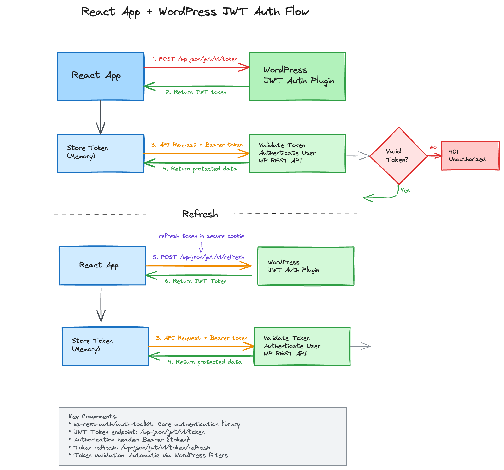
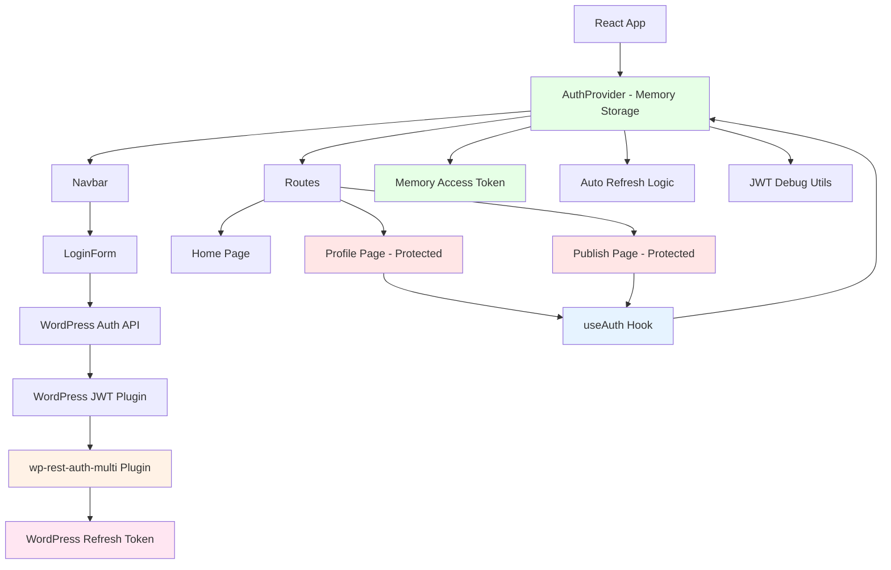

# React WordPress JWT Demo

A modern React application demonstrating secure JWT authentication directly with WordPress REST API using the [wp-rest-auth-multi](https://github.com/juanma-wp/wp-rest-auth-multi) plugin. Features access tokens in memory and refresh tokens handled by WordPress.

[](https://excalidraw.com/#json=7jKgRoCJniUvR5I-6gvD6,oCqJa8TA3Mn960oagaOb2A)

see [diagram](https://excalidraw.com/#json=7jKgRoCJniUvR5I-6gvD6,oCqJa8TA3Mn960oagaOb2A)

> **⚠️ Important:** This demo is specifically designed to work with the [wp-rest-auth-multi](https://github.com/juanma-wp/wp-rest-auth-multi) WordPress plugin. Other JWT plugins may not work without modifications.

## 🚀 Features

- **🔐 Direct WordPress JWT Authentication**: No proxy server required
- **🔄 Automatic Token Refresh**: Silent re-authentication via WordPress endpoints
- **🛡️ XSS Protection**: Access tokens in memory, refresh tokens managed by WordPress
- **🗄️ WordPress REST API**: Direct integration with WordPress REST API
- **⚛️ React Router**: Protected routes with authentication guards
- **💅 Modern UI**: Tailwind CSS with responsive design
- **📝 TypeScript**: Full type safety and IntelliSense
- **🐛 Debug Tools**: Comprehensive JWT debugging and validation

## 📋 Prerequisites

Before running this project, ensure you have the following installed:

### Required Software
- **Node.js** (version 16 or higher)
- **npm** or **yarn** package manager
- **WordPress site** with JWT authentication plugin

### WordPress Setup

1. **Install Required Plugin**: This demo requires the following WordPress plugin:
   - **[wp-rest-auth-multi](https://github.com/juanma-wp/wp-rest-auth-multi)** (mandatory)

   > **Note:** This demo uses specific response formats and endpoints from wp-rest-auth-multi. Other JWT plugins will require code modifications.

2. **WordPress Config**: Add JWT secret to `wp-config.php` (required by wp-rest-auth-multi):
   ```php
   define('WP_JWT_AUTH_SECRET', 'your-very-long-and-random-secret-key-here');
   define('WP_JWT_ACCESS_TTL', 900);     // 15 minutes (optional)
   define('WP_JWT_REFRESH_TTL', 1209600); // 14 days (optional)
   ```

## 🛠️ Installation

### 1. Install Dependencies

```bash
# Install React app dependencies
npm install
```

### 2. Configure Environment

Copy and configure the environment variables:
```bash
cp .env.example .env.local
# Edit with your WordPress URL and JWT plugin configuration
```

### 3. Environment Variables

**React App (`.env.local`)**:
```env
# WordPress Configuration
VITE_WP_BASE_URL=https://your-wordpress-site.com/
VITE_WP_API_NAMESPACE=wp-json
VITE_WP_JWT_NAMESPACE=jwt/v1

# WordPress JWT Endpoints (wp-rest-auth-multi plugin)
VITE_WP_JWT_TOKEN_ENDPOINT=/token
VITE_WP_JWT_REFRESH_ENDPOINT=/refresh
VITE_WP_JWT_VERIFY_ENDPOINT=/verify
VITE_WP_JWT_LOGOUT_ENDPOINT=/logout

# Debug
VITE_DEBUG=true
```

## 🚀 Running the Project

Start the React development server:

```bash
npm run dev
```

- **React App**: http://localhost:5173

For production deployment, see [DEPLOYMENT.md](./DEPLOYMENT.md)

## 📁 Project Structure

```
react-wp-jwt-demo/
├── src/                    # React app source
│   ├── api/               # API layer
│   │   ├── auth.ts       # WordPress JWT authentication API
│   │   └── wp.ts         # WordPress REST API calls
│   ├── components/       # Reusable UI components
│   │   ├── LoginForm.tsx # Login form component
│   │   └── Navbar.tsx    # Navigation component
│   ├── context/         # React Context providers
│   │   └── AuthContext.tsx # Authentication state management
│   ├── lib/            # Utility libraries
│   │   ├── http.ts     # HTTP client configuration
│   │   └── useLocalStorage.ts # Local storage hook
│   ├── pages/          # Page components
│   │   ├── Home.tsx    # Home page
│   │   ├── Profile.tsx # User profile page
│   │   └── Publish.tsx # Content publishing page
│   ├── utils/          # Utility functions
│   │   └── jwt-debug.ts # JWT debugging utilities
│   ├── App.tsx         # Main app component
│   ├── main.tsx       # App entry point
│   ├── routes.tsx     # Route definitions
│   └── vite-env.d.ts  # TypeScript environment definitions
└── package.json       # React app dependencies
```

### Component Architecture


## 🔧 Technology Stack

### Frontend (React App)
- **React 18** - UI library
- **TypeScript** - Type safety
- **Vite** - Build tool and dev server
- **React Router DOM** - Client-side routing
- **Tailwind CSS** - Utility-first CSS framework
- **Ky** - Modern HTTP client
- **PostCSS & Autoprefixer** - CSS processing

### Backend (WordPress)
- **WordPress** - Content management system
- **wp-rest-auth-multi Plugin** - JWT authentication
- **WordPress REST API** - Standard WordPress API
- **cors** - Cross-origin resource sharing
- **ky** - HTTP client for WordPress API calls

## 🔐 Architecture Overview

This demo uses a **direct WordPress integration architecture**:

```
┌─────────────────┐                        ┌─────────────────┐
│   React App     │◄──────────────────────►│   WordPress     │
│  (Frontend UI)  │                        │   REST API      │
│                 │                        │ (Content + Auth)│
└─────────────────┘                        └─────────────────┘
   Memory Storage                             JWT Plugin
   (Access Tokens)                         (User Auth + Refresh)
```

### 🔄 Authentication Flow

1. **Login**: User → WordPress JWT Plugin → Tokens generated
2. **Storage**: Access token (memory) + Refresh token (WordPress managed)
3. **API Calls**: React App → WordPress REST API (direct)
4. **Auto Refresh**: Silent token renewal using WordPress refresh endpoint
5. **Logout**: Clear tokens via WordPress logout endpoint

### 🛡️ Security Features

- **XSS Protection**: Access tokens stored in memory only
- **Session Persistence**: WordPress handles refresh token management
- **CSRF Protection**: WordPress built-in CSRF protection
- **Auto Recovery**: Silent login on app restart via WordPress refresh
- **Direct Integration**: No proxy server required

## 🐛 Debugging

Enable debugging in your React app environment:

```env
# React App
VITE_DEBUG=true
```

Check browser console for `🔍 JWT Debug` messages covering:
- Authentication flow
- Token validation
- API requests/responses
- Silent login attempts

## 🚨 Troubleshooting

**Login fails**: Check WordPress credentials and JWT plugin configuration
**CORS errors**: The wp-rest-auth-multi plugin should handle CORS automatically
**Session lost**: Verify WordPress refresh token handling is working
**API errors**: Check WordPress JWT plugin endpoints and SSL certificates

## ✨ Plugin Integration

This demo has been specifically optimized to work with the [wp-rest-auth-multi](https://github.com/juanma-wp/wp-rest-auth-multi) plugin:

### Plugin-Specific Features Used:
- **✅ Standardized response format** - Uses wp-rest-auth-multi's `{success, data, message}` structure
- **✅ Built-in refresh token handling** - Plugin manages HttpOnly cookies automatically
- **✅ JWT verify endpoint** - Uses `/wp-json/jwt/v1/verify` for user profile data
- **✅ CORS support** - Plugin handles cross-origin requests (when configured)
- **✅ Secure cookie management** - Automatic refresh token handling via secure cookies

### wp-rest-auth-multi Response Format:
```javascript
// Plugin returns standardized format:
{
  "success": true,
  "data": {
    "access_token": "eyJ0eXAiOiJKV1QiLCJhbGc...",
    "token_type": "Bearer",
    "expires_in": 900,
    "user": {
      "id": 1,
      "username": "admin",
      "email": "admin@example.com",
      "roles": ["administrator"]
    }
  },
  "message": "Login successful"
}

// React code simply accesses:
const data = res.data;
const token = data.access_token;
const user = data.user;
```

## 📚 Additional Documentation

- **[DEPLOYMENT.md](./DEPLOYMENT.md)** - Production deployment guide

## 🤝 Contributing

This is a demo project for educational purposes. Feel free to fork and modify for your own learning or projects.

## 📄 License

This project is for demonstration purposes. Check individual package licenses for dependencies.
