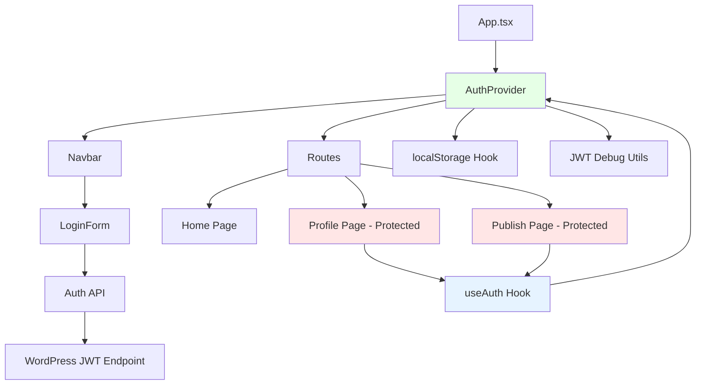
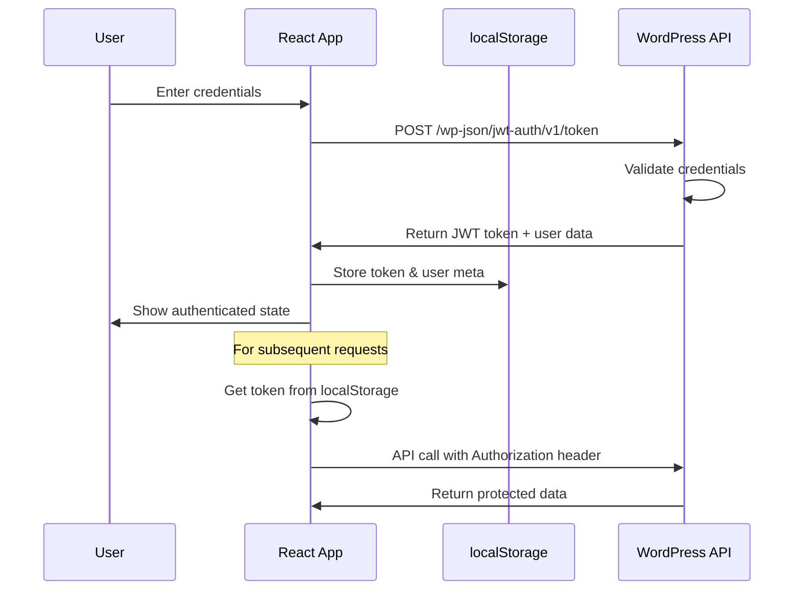

# React WordPress JWT Demo

A demonstration React application that showcases JWT authentication integration with WordPress REST API. This project demonstrates how to build a modern React frontend that authenticates with WordPress using JWT tokens.

## 🚀 Features

- **JWT Authentication**: Secure login/logout with WordPress JWT tokens
- **React Router**: Client-side routing with protected routes
- **Modern UI**: Built with Tailwind CSS for responsive design
- **TypeScript**: Full type safety throughout the application
- **Debug Tools**: Built-in JWT token validation and debugging
- **Local Storage**: Persistent authentication state
- **WordPress Integration**: Direct integration with WordPress REST API

## 📋 Prerequisites

Before running this project, ensure you have the following installed:

### Required Software
- **Node.js** (version 16 or higher)
- **npm** or **yarn** package manager
- **WordPress site** with JWT authentication plugin

### WordPress Setup

1. **Install JWT Authentication Plugin**
   - Install the [JWT Authentication for WP REST API](https://wordpress.org/plugins/jwt-authentication-for-wp-rest-api/) plugin
   - Or manually install a JWT authentication plugin that provides the `/wp-json/jwt-auth/v1/token` endpoint

2. **Configure WordPress**
   - Add the following to your WordPress `wp-config.php` file:
   ```php
   define('JWT_AUTH_SECRET_KEY', 'your-top-secret-key');
   define('JWT_AUTH_CORS_ENABLE', true);
   ```

3. **Enable CORS** (if needed)
   - Add CORS headers to allow requests from your React app domain
   - The plugin should handle this if `JWT_AUTH_CORS_ENABLE` is set to `true`

## 🛠️ Installation

1. **Clone or navigate to the project directory**
   ```bash
   cd react-wp-jwt-demo
   ```

2. **Install dependencies**
   ```bash
   npm install
   ```

3. **Configure environment variables**
   Create a `.env` file in the project root:
   ```env
   VITE_WP_BASE_URL=https://your-wordpress-site.com
   ```
   Replace `https://your-wordpress-site.com` with your actual WordPress site URL.

## 🚀 Running the Project

### Development Mode
```bash
npm run dev
```
This will start the development server at `http://localhost:5173`

### Build for Production
```bash
npm run build
```

### Preview Production Build
```bash
npm run preview
```

## 📁 Project Structure

```
src/
├── api/                 # API layer
│   ├── auth.ts         # Authentication API calls
│   └── wp.ts           # WordPress REST API calls
├── components/         # Reusable UI components
│   ├── LoginForm.tsx   # Login form component
│   └── Navbar.tsx      # Navigation component
├── context/           # React Context providers
│   └── AuthContext.tsx # Authentication state management
├── lib/               # Utility libraries
│   ├── http.ts        # HTTP client configuration
│   └── useLocalStorage.ts # Local storage hook
├── pages/             # Page components
│   ├── Home.tsx       # Home page
│   ├── Profile.tsx    # User profile page
│   └── Publish.tsx    # Content publishing page
├── utils/             # Utility functions
│   └── jwt-debug.ts   # JWT debugging utilities
├── App.tsx            # Main app component
├── main.tsx          # App entry point
└── routes.tsx        # Route definitions
```

### Component Architecture


## 🔧 Technology Stack

- **React 18** - UI library
- **TypeScript** - Type safety
- **Vite** - Build tool and dev server
- **React Router DOM** - Client-side routing
- **Tailwind CSS** - Utility-first CSS framework
- **Ky** - Modern HTTP client
- **PostCSS & Autoprefixer** - CSS processing

## 🔐 Authentication Flow





### Step-by-Step Process

1. **User Login**: User enters credentials in the login form
2. **API Request**: App makes POST request to `/wp-json/jwt-auth/v1/token`
3. **WordPress Validation**: WordPress validates credentials against user database
4. **Token Generation**: WordPress generates and returns JWT token with user data
5. **Local Storage**: Token and user metadata stored in browser localStorage
6. **State Update**: AuthContext updates with authenticated state
7. **Route Protection**: Protected routes check for valid token before rendering
8. **API Calls**: Subsequent requests include token in Authorization header

## 🐛 Debugging

The application includes comprehensive JWT debugging features:

- **Console Logging**: Detailed logs for authentication flow
- **Token Validation**: Automatic JWT token structure validation
- **Request Tracking**: HTTP request/response logging
- **Token Preview**: Safe token preview in console (first 20 characters)

Check the browser console for debugging information prefixed with `🔍 JWT Debug`.

## 🔧 Configuration

### Environment Variables

| Variable | Description | Required |
|----------|-------------|----------|
| `VITE_WP_BASE_URL` | Your WordPress site URL | Yes |

### WordPress Plugin Configuration

Ensure your JWT plugin is configured with:
- Secret key for token signing
- CORS enabled for your domain
- Proper endpoint `/wp-json/jwt-auth/v1/token`

## 🚨 Troubleshooting

### Common Issues

1. **CORS Errors**
   - Ensure CORS is enabled in your WordPress JWT plugin
   - Check that your domain is allowed in CORS settings

2. **Authentication Fails**
   - Verify WordPress credentials are correct
   - Check that JWT plugin is active and configured
   - Ensure the JWT secret key is set in wp-config.php

3. **Token Invalid**
   - Check token expiration settings in WordPress
   - Verify the JWT secret key matches between WordPress and any validation

4. **API Endpoints Not Found**
   - Confirm JWT authentication plugin is installed and active
   - Check that permalink structure is not "Plain"

## 📚 API Endpoints Used

- `POST /wp-json/jwt-auth/v1/token` - Login and get JWT token
- `POST /wp-json/jwt-auth/v1/token/validate` - Validate existing token (if supported by plugin)

## 🤝 Contributing

This is a demo project for educational purposes. Feel free to fork and modify for your own learning or projects.

## 📄 License

This project is for demonstration purposes. Check individual package licenses for dependencies.
