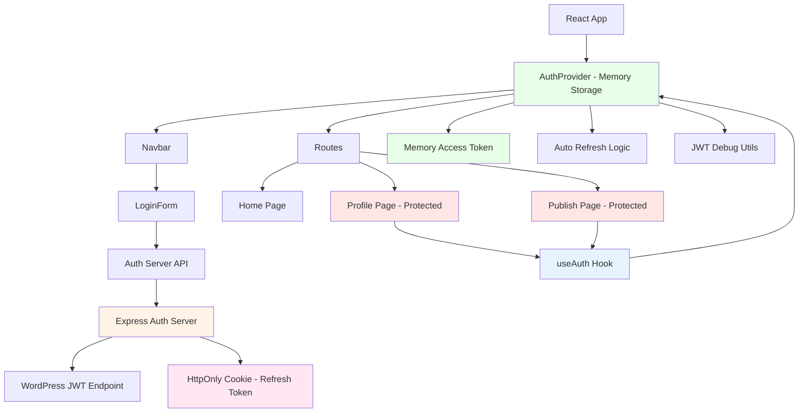

# React WordPress JWT Demo

A modern React application demonstrating secure JWT authentication with WordPress REST API using a hybrid approach: access tokens in memory + refresh tokens in HttpOnly cookies via an Express auth server.

## 🚀 Features

- **🔐 Secure JWT Authentication**: Hybrid approach with Express auth server
- **🔄 Automatic Token Refresh**: Silent re-authentication on page load
- **🛡️ XSS Protection**: Access tokens in memory, refresh tokens in HttpOnly cookies
- **🗄️ WordPress API Proxy**: Secure WordPress REST API integration
- **⚛️ React Router**: Protected routes with authentication guards
- **💅 Modern UI**: Tailwind CSS with responsive design
- **📝 TypeScript**: Full type safety and IntelliSense
- **🐛 Debug Tools**: Comprehensive JWT debugging and validation

## 📋 Prerequisites

Before running this project, ensure you have the following installed:

### Required Software
- **Node.js** (version 16 or higher)
- **npm** or **yarn** package manager
- **WordPress site** with JWT authentication plugin

### WordPress Setup

1. **Install JWT Plugin**: Install a WordPress JWT plugin like:
   - [wp-rest-auth-multi](https://github.com/juanma-wp/wcg2025-demos/tree/main/wp-rest-auth-multi) (recommended)
   - [JWT Authentication for WP REST API](https://wordpress.org/plugins/jwt-authentication-for-wp-rest-api/)

2. **Configure Plugin**: Set up your chosen plugin's endpoints in the auth server's `.env` file

3. **WordPress Config**: Add JWT secret to `wp-config.php` (`wp-rest-auth-multi` plugin):
   ```php
   define('WP_JWT_AUTH_SECRET', 'your-very-long-and-random-secret-key-here');
   define('WP_JWT_ACCESS_TTL', 900);     // 15 minutes (optional)
   define('WP_JWT_REFRESH_TTL', 1209600); // 14 days (optional)
   ```

## 🛠️ Installation

### 1. Install Dependencies

```bash
# Install React app dependencies
npm install

# Install auth server dependencies
cd server && npm install
```

### 2. Configure Environment

**React App**: Copy and configure the client environment:
```bash
cp .env.example .env.local
# Edit with your WordPress URL and auth server URL
```

**Auth Server**: Copy and configure the server environment:
```bash
cd server
cp .env.example .env
# Edit with your WordPress JWT plugin endpoints and secrets
```

### 3. Environment Variables

**React App (`.env.local`)**:
```env
VITE_AUTH_SERVER_URL=http://localhost:3001
VITE_WP_BASE_URL=https://your-wordpress-site.com
VITE_DEBUG=true
```

**Auth Server (`server/.env`)**:
```env
WP_BASE_URL=https://your-wordpress-site.com/
WP_JWT_NAMESPACE=jwt/v1
ACCESS_TOKEN_SECRET=your-secure-random-secret
REFRESH_TOKEN_SECRET=your-secure-random-secret
CLIENT_URL=http://localhost:5173
DEBUG=true
SSL_VERIFY=false  # For local development only
```

## 🚀 Running the Project

Start both services in separate terminals:

```bash
# Terminal 1: Start auth server
cd server && npm run dev

# Terminal 2: Start React app
npm run dev
```

- **React App**: http://localhost:5173
- **Auth Server**: http://localhost:3001

For production deployment, see [DEPLOYMENT.md](./DEPLOYMENT.md)

## 📁 Project Structure

```
react-wp-jwt-demo/
├── src/                    # React app source
│   ├── api/               # API layer
│   │   ├── auth.ts       # Auth server API calls
│   │   └── wp.ts         # WordPress REST API calls
│   ├── components/       # Reusable UI components
│   │   ├── LoginForm.tsx # Login form component
│   │   └── Navbar.tsx    # Navigation component
│   ├── context/         # React Context providers
│   │   └── AuthContext.tsx # Authentication state management
│   ├── lib/            # Utility libraries
│   │   ├── http.ts     # HTTP client configuration
│   │   └── useLocalStorage.ts # Local storage hook
│   ├── pages/          # Page components
│   │   ├── Home.tsx    # Home page
│   │   ├── Profile.tsx # User profile page
│   │   └── Publish.tsx # Content publishing page
│   ├── utils/          # Utility functions
│   │   └── jwt-debug.ts # JWT debugging utilities
│   ├── App.tsx         # Main app component
│   ├── main.tsx       # App entry point
│   └── routes.tsx     # Route definitions
├── server/            # Auth server
│   ├── server.js      # Express server with JWT handling
│   ├── package.json   # Server dependencies
│   ├── .env.example   # Environment template
│   └── README.md      # Server documentation
└── package.json       # React app dependencies
```

### Component Architecture


## 🔧 Technology Stack

### Frontend (React App)
- **React 18** - UI library
- **TypeScript** - Type safety
- **Vite** - Build tool and dev server
- **React Router DOM** - Client-side routing
- **Tailwind CSS** - Utility-first CSS framework
- **Ky** - Modern HTTP client
- **PostCSS & Autoprefixer** - CSS processing

### Backend (Auth Server)
- **Node.js** - Runtime
- **Express.js** - Web framework
- **jsonwebtoken** - JWT creation and verification
- **cookie-parser** - Cookie handling middleware
- **cors** - Cross-origin resource sharing
- **ky** - HTTP client for WordPress API calls

## 🔐 Architecture Overview

This demo uses a **3-tier security architecture**:

```
┌─────────────────┐    ┌─────────────────┐    ┌─────────────────┐
│   React App     │    │  Express Auth   │    │   WordPress     │
│  (Frontend UI)  │◄──►│     Server      │◄──►│   REST API      │
│                 │    │  (JWT Handler)  │    │ (Content + Auth)│
└─────────────────┘    └─────────────────┘    └─────────────────┘
   Memory Storage        HttpOnly Cookies       JWT Plugin
   (Access Tokens)      (Refresh Tokens)       (User Auth)
```

### 🔄 Authentication Flow

1. **Login**: User → Auth Server → WordPress → Tokens generated
2. **Storage**: Access token (memory) + Refresh token (HttpOnly cookie)
3. **API Calls**: React App → Auth Server (proxy) → WordPress API
4. **Auto Refresh**: Silent token renewal on page load using refresh cookie
5. **Logout**: Clear all tokens and invalidate session

### 🛡️ Security Features

- **XSS Protection**: Tokens not in localStorage
- **Session Persistence**: HttpOnly cookies survive refreshes
- **CSRF Protection**: SameSite cookie attributes
- **Auto Recovery**: Silent login on app restart
- **Proxy Pattern**: WordPress never exposed to frontend

## 🐛 Debugging

Enable debugging in both environments:

```env
# React App
VITE_DEBUG=true

# Auth Server
DEBUG=true
```

Check browser console for `🔍 JWT Debug` messages covering:
- Authentication flow
- Token validation
- API requests/responses
- Silent login attempts

## 🚨 Troubleshooting

**Login fails**: Check WordPress credentials and JWT plugin configuration
**CORS errors**: Ensure auth server CORS allows your React app domain
**Session lost**: Verify refresh token cookies are being set and sent
**API errors**: Check WordPress JWT plugin endpoints and SSL certificates

## 📚 Additional Documentation

- **[DEPLOYMENT.md](./DEPLOYMENT.md)** - Production deployment guide
- **[server/README.md](./server/README.md)** - Auth server documentation

## 🤝 Contributing

This is a demo project for educational purposes. Feel free to fork and modify for your own learning or projects.

## 📄 License

This project is for demonstration purposes. Check individual package licenses for dependencies.
