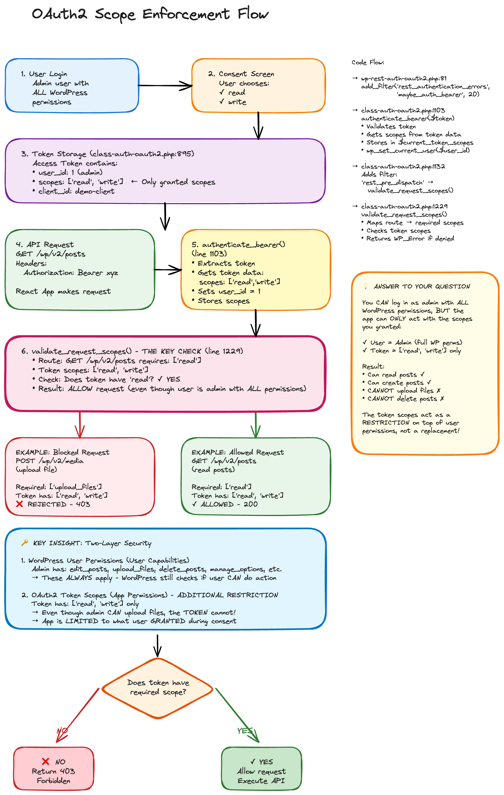

# OAuth2 Scope Enforcement in WordPress

## Overview

This document explains how OAuth2 scopes work as an **additional security layer** on top of WordPress user permissions, allowing you to safely grant third-party applications limited access to your WordPress site even when logged in as an administrator.



## The Problem

Imagine you're an **admin user** with full WordPress permissions (edit posts, upload files, delete content, manage users, etc.). When you connect a third-party React app to your WordPress site, you don't want to give it **all** your admin powers. That would be dangerous!

**Question:** How can you log in as admin but only allow the app to read and create posts, without giving it permission to delete content or upload files?

**Answer:** OAuth2 Scopes!

---

## Two-Layer Security Model

WordPress OAuth2 uses a **two-layer security model**:

### 1️⃣ **WordPress User Permissions** (Base Layer)
These are your **WordPress capabilities** based on your user role:
- Admin has: `edit_posts`, `upload_files`, `delete_posts`, `manage_options`, etc.
- These ALWAYS apply - WordPress still checks if the user CAN perform the action

### 2️⃣ **OAuth2 Token Scopes** (Restriction Layer)
These are the **permissions you explicitly grant** to the app during the OAuth2 consent screen:
- Token might only have: `['read', 'write']`
- **Even though you (admin) CAN upload files, the TOKEN cannot!**
- The app is LIMITED to what you GRANTED during consent

---

## How It Works: Step-by-Step

### Step 1: User Login (Admin with ALL Permissions)
```
User: admin
WordPress Capabilities:
   edit_posts
   upload_files
   delete_posts
   manage_options
   manage_users
  ... (everything!)
```

### Step 2: OAuth2 Consent Screen
The app requests access and shows you a consent screen:

```
React WordPress OAuth2 Demo wants to access your WordPress Account

This will allow "React WordPress OAuth2 Demo" to:
   read   - View your posts, pages, and profile information
   write  - Create and edit posts and pages
   upload_files - Upload and manage media files (NOT GRANTED)
   delete - Delete posts and pages (NOT GRANTED)

[Cancel] [Allow]
```

**You choose** which permissions to grant. In this example, you only grant `read` and `write`.

### Step 3: Token Storage
After you click "Allow", WordPress creates an **access token** that contains:

```json
{
  "user_id": 1,
  "client_id": "demo-client",
  "scopes": ["read", "write"],  // ✅ Only granted scopes!
  "expires": 1234567890
}
```

**Key Point:** The token does NOT contain all your admin permissions - only the scopes you granted!

### Step 4: API Request
The React app makes a request to WordPress:

```http
GET /wp-json/wp/v2/posts
Authorization: Bearer abc123xyz...
```

### Step 5: Bearer Authentication
WordPress plugin (`wp-rest-auth-oauth2.php`):
1. Extracts the Bearer token
2. Validates the token
3. Gets the token data: `scopes: ['read', 'write']`
4. Sets the current user: `wp_set_current_user(1)` (admin)
5. **Stores the scopes** for later validation

### Step 6: Scope Validation (THE KEY CHECK!)
Before executing the API request, WordPress checks:

```php
// class-auth-oauth2.php:1229 - validate_request_scopes()

Route: GET /wp/v2/posts
Required scopes: ['read']
Token scopes: ['read', 'write']

Check: Does token have 'read'?  ✅ YES
Result: ✅ ALLOW request 
```

### Step 7: Decision Point

```
                                 
| Does token have required scope? 
            ↓           ↓        
                        
           NO           YES
             ↓           ↓
                                
     🚫 REJECT      ✅ ALLOW      
     Return 403    Execute API  
                                
```

---

## Real Examples

### ✅ Example 1: Allowed Request (Read Posts)

```http
GET /wp-json/wp/v2/posts
```

**Required scope:** `read`
**Token has:** `['read', 'write']`
**Result:** ✅ **200 OK** - Request allowed

Even though you're an admin with full permissions, the request succeeds because:
1. ✅ User (admin) CAN view posts (WordPress capability check)
2. ✅ Token HAS `read` scope (OAuth2 scope check)

---

### ✅ Example 2: Allowed Request (Create Post)

```http
POST /wp-json/wp/v2/posts
Content-Type: application/json

{
  "title": "Hello World",
  "content": "My first post via OAuth2",
  "status": "draft"
}
```

**Required scope:** `write`
**Token has:** `['read', 'write']`
**Result:** ✅ **201 Created** - Post created successfully

---

### 🚫 Example 3: Blocked Request (Upload File)

```http
POST /wp-json/wp/v2/media
Content-Type: multipart/form-data
```

**Required scope:** `upload_files`
**Token has:** `['read', 'write']`
**Result:** 🚫 **403 Forbidden** - Insufficient scope

```json
{
  "code": "rest_forbidden_scope",
  "message": "Insufficient OAuth2 scope. This POST request to /wp/v2/media requires one of the following scopes: [upload_files]. Your access token only has: [read, write].",
  "data": {
    "status": 403,
    "oauth2_error": "insufficient_scope",
    "required_scopes": ["upload_files"],
    "token_scopes": ["read", "write"]
  }
}
```

**Why was it blocked?**
1. ✅ User (admin) CAN upload files (WordPress capability check passes)
2. 🚫 Token DOES NOT have `upload_files` scope (OAuth2 scope check fails)

**The OAuth2 layer blocked the request, even though the user has permission!**

---

### 🚫 Example 4: Blocked Request (Delete Post)

```http
DELETE /wp-json/wp/v2/posts/123
```

**Required scope:** `delete`
**Token has:** `['read', 'write']`
**Result:** 🚫 **403 Forbidden** - Insufficient scope

Same logic: You're an admin who CAN delete posts, but the token doesn't have the `delete` scope, so the request is blocked.

---

## Available OAuth2 Scopes

The plugin defines these scopes in `class-auth-oauth2.php:22-31`:

| Scope | Description | WordPress Capability Required |
|-------|-------------|------------------------------|
| `read` | View posts, pages, media, comments, and profile information | None (everyone can read) |
| `write` | Create and edit posts and pages | `edit_posts` |
| `delete` | Delete posts and pages | `delete_posts` |
| `upload_files` | Upload and manage media files | `upload_files` |
| `manage_categories` | Create, edit, and delete categories and tags | `edit_posts` |
| `moderate_comments` | Moderate and manage comments | `moderate_comments` |
| `manage_users` | View and manage user accounts (admin only) | `list_users` |
| `edit_theme` | Modify theme and appearance settings (admin only) | `edit_theme_options` |
| `view_stats` | Access website statistics and analytics | `view_query_monitor` |

---

## Code Flow

Here's how the scope enforcement works internally:

### 1. Hook Registration (`wp-rest-auth-oauth2.php:81`)
```php
add_filter('rest_authentication_errors', [$this, 'maybe_auth_bearer'], 20);
```

### 2. Bearer Authentication (`class-auth-oauth2.php:1103`)
```php
public function authenticate_bearer(string $token) {
    $token_data = get_transient($this->token_key($token));

    if (!$token_data) {
        return new WP_Error('invalid_token', 'Invalid or expired access token');
    }

    // Store token scopes for later validation
    $this->current_token_scopes = $token_data['scopes'] ?? [];

    // Set current user
    wp_set_current_user($token_data['user_id']);

    // Add scope validation filter
    add_filter('rest_pre_dispatch', [$this, 'validate_request_scopes'], 10, 3);

    return true;
}
```

### 3. Scope Validation Hook (`class-auth-oauth2.php:1132`)
```php
add_filter('rest_pre_dispatch', [$this, 'validate_request_scopes'], 10, 3);
```

### 4. The Key Check (`class-auth-oauth2.php:1229-1296`)
```php
public function validate_request_scopes($result, $server, $request) {
    if (is_wp_error($result) || empty($this->current_token_scopes)) {
        return $result;
    }

    $route = $request->get_route();
    $method = $request->get_method();

    // Get required scopes for this endpoint
    $required_scopes = $this->get_endpoint_required_scopes($route, $method);

    if (empty($required_scopes)) {
        return $result; // No specific scopes required
    }

    // Check if token has at least one required scope
    $has_required_scope = false;
    foreach ($required_scopes as $required_scope) {
        if (in_array($required_scope, $this->current_token_scopes)) {
            $has_required_scope = true;
            break;
        }
    }

    if (!$has_required_scope) {
        return new WP_Error(
            'rest_forbidden_scope',
            sprintf(
                'Insufficient OAuth2 scope. This %s request to %s requires: [%s]. Your token only has: [%s]',
                $method,
                $route,
                implode(', ', $required_scopes),
                implode(', ', $this->current_token_scopes)
            ),
            ['status' => 403, 'oauth2_error' => 'insufficient_scope']
        );
    }

    return $result; // Allow request
}
```

### 5. Route to Scope Mapping (`class-auth-oauth2.php:1301-1362`)
```php
private function get_endpoint_required_scopes(string $route, string $method): array {
    $endpoint_scopes = [
        // Posts
        'GET:/wp/v2/posts' => ['read'],
        'POST:/wp/v2/posts' => ['write'],
        'PUT:/wp/v2/posts/*' => ['write'],
        'DELETE:/wp/v2/posts/*' => ['delete'],

        // Media
        'GET:/wp/v2/media' => ['read'],
        'POST:/wp/v2/media' => ['upload_files'],
        'DELETE:/wp/v2/media/*' => ['upload_files'],

        // Comments
        'GET:/wp/v2/comments' => ['read'],
        'POST:/wp/v2/comments' => ['moderate_comments'],

        // Categories
        'GET:/wp/v2/categories' => ['read'],
        'POST:/wp/v2/categories' => ['manage_categories'],

        // ... more mappings
    ];

    $route_pattern = $method . ':' . $route;
    return $endpoint_scopes[$route_pattern] ?? [];
}
```

---

## Security Benefits

### 🔒 Principle of Least Privilege
Apps only get the minimum permissions they need to function.

### 👤 User Control
Users explicitly choose what permissions to grant during the consent screen.

### 🛡️ Defense in Depth
Even if an app is compromised, the damage is limited to the granted scopes.

### 👁️ Transparency
Users can see exactly what an app can and cannot do.

### ⏰ Time-Limited Access
Access tokens expire (default: 1 hour), limiting the window of potential abuse.

---

## Key Takeaways

1. **OAuth2 scopes are NOT a replacement for WordPress permissions** - they're an additional restriction layer on top.

2. **Both checks must pass:**
   - ✅ WordPress checks: "Can this USER perform this action?" (capabilities)
   - 🔑 OAuth2 checks: "Does this TOKEN allow this action?" (scopes)

3. **Admin users with limited token scopes** = Safe third-party app integration
   - You keep your admin powers
   - The app only gets what you explicitly granted

4. **Scopes are stored in the access token**, not in the user account
   - Different apps can have different scopes for the same user

5. **The `validate_request_scopes()` function** is the gatekeeper that enforces scope restrictions before any API action executes.

---

## Visual Diagram

For a visual representation of this flow, see the Excalidraw diagram in the OAuth2 plugin repository:
- [`wp-rest-auth-oauth2/docs/oauth2-scope-enforcement-flow.excalidraw`](https://github.com/juanma-wp/wp-rest-auth-oauth2/blob/main/docs/oauth2-scope-enforcement-flow.excalidraw)
- Import this into [Excalidraw](https://excalidraw.com) to view the interactive diagram

---

## References

- Plugin source: [`wp-rest-auth-oauth2`](https://github.com/juanma-wp/wp-rest-auth-oauth2)
- Auth toolkit: [`wp-rest-auth/auth-toolkit`](https://github.com/wp-rest-auth/auth-toolkit)
- OAuth2 RFC: [RFC 6749 - The OAuth 2.0 Authorization Framework](https://datatracker.ietf.org/doc/html/rfc6749)
- PKCE RFC: [RFC 7636 - Proof Key for Code Exchange](https://datatracker.ietf.org/doc/html/rfc7636)

---

## FAQ

### Q: What happens if I grant all scopes?
**A:** Then the token has the same permissions as your WordPress user (within OAuth2's defined scopes). But you still can't do things outside of OAuth2's scope system (like accessing wp-admin directly).

### Q: Can I revoke access after granting it?
**A:** Yes! Access tokens expire after 1 hour. For long-term revocation, you can:
1. Delete the refresh token from the database (`wp_oauth2_refresh_tokens` table)
2. Use the `/wp-json/oauth2/v1/revoke` endpoint
3. Change your WordPress password (invalidates all tokens)

### Q: What if my app needs a scope that doesn't exist?
**A:** You can add custom scopes by:
1. Adding them to `AVAILABLE_SCOPES` in `class-auth-oauth2.php`
2. Adding route mappings in `get_endpoint_required_scopes()`
3. Implementing capability checks in `user_can_access_scope()`

### Q: Can I see what scopes a token has?
**A:** Yes! The `/wp-json/oauth2/v1/userinfo` endpoint returns the granted scopes in its response:
```json
{
  "user_id": "1",
  "granted_scopes": ["read", "write"],
  "user": { ... }
}
```

### Q: Why do I get 401 instead of 403?
**A:**
- **401 Unauthorized** = Invalid/expired token, or no authentication at all
- **403 Forbidden** = Valid token, but insufficient scopes for this action

---

## Testing Scope Enforcement

Try these requests in the React demo app to see scopes in action:

1. ✅ **Request with granted scope** (read posts)
2. ✅ **Request with granted scope** (create post)
3. 🚫 **Request without required scope** (upload file) - should get 403
4. 🚫 **Request without required scope** (delete post) - should get 403

The demo app shows these examples with clear visual feedback! 🎯

---

Made with ❤️ for [WordCamp Galicia 2025](https://galicia.wordcamp.org/2025/)