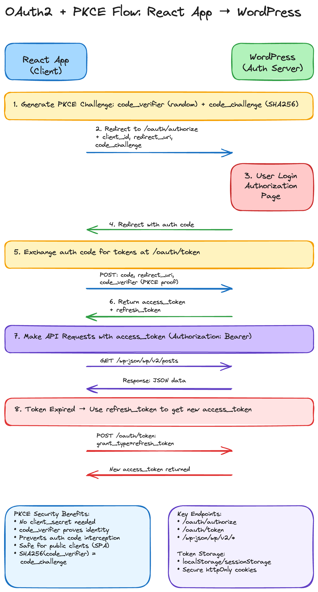

# React WordPress OAuth2 Demo

A React application demonstrating OAuth2 authentication with WordPress using the [OAuth2 Auth Pro - WP REST API](https://github.com/juanma-wp/oauth2-auth-pro-wp-rest-api) plugin. This demo showcases the OAuth2 Authorization Code flow for secure WordPress REST API integration.

[](https://excalidraw.com/#json=YGBS9qb176pnicnENaBH7,yu7uFNilUpicQozCIiKziw)

see [diagram](https://excalidraw.com/#json=YGBS9qb176pnicnENaBH7,yu7uFNilUpicQozCIiKziw)

## 🚀 Features

- **🔐 OAuth2 Authentication**: Authorization Code flow with WordPress
- **🔄 Automatic Token Refresh**: Silent re-authentication using refresh tokens
- **🛡️ Secure Token Storage**: Access tokens in memory, refresh tokens in localStorage
- **📱 Responsive Design**: Modern UI with Tailwind CSS
- **🐛 Debug Tools**: Comprehensive OAuth debugging and logging
- **⚛️ React Router**: Callback handling for OAuth redirects
- **💅 TypeScript**: Full type safety and IntelliSense

## 📋 Prerequisites

### Required Software
- **Node.js** (version 16 or higher)
- **npm** or **yarn** package manager
- **WordPress site** with OAuth2 Auth Pro plugin

### WordPress Setup

1. **Install Plugin**: Install the [OAuth2 Auth Pro - WP REST API](https://github.com/juanma-wp/oauth2-auth-pro-wp-rest-api) plugin

2. **Configure WordPress**: Add OAuth2 secret to `wp-config.php`:
   ```php
   define('WP_OAUTH2_SECRET', 'your-very-long-and-random-secret-key-here');
   define('WP_OAUTH2_ACCESS_TTL', 3600);      // 1 hour (optional)
   define('WP_OAUTH2_REFRESH_TTL', 2592000);  // 30 days (optional)
   ```

3. **OAuth2 Client**: The plugin automatically creates a demo OAuth2 client:
   - **Client ID**: `demo-client`
   - **Client Secret**: `demo-secret`
   - **Allowed Redirect URIs**: `http://localhost:5174/callback`

## 🛠️ Installation

### 1. Install Dependencies
```bash
npm install
```

### 2. Configure Environment
```bash
cp .env.example .env.local
# Edit with your WordPress URL
```

### 3. Environment Variables

**`.env.local`**:
```env
VITE_WP_BASE_URL=https://your-wordpress-site.com
VITE_OAUTH_CLIENT_ID=demo-client
VITE_OAUTH_REDIRECT_URI=http://localhost:5174/callback
VITE_DEBUG=true
```

## 🚀 Running the Project

```bash
npm run dev
```

The application will be available at: **http://localhost:5174**

## 📁 Project Structure

```
react-wp-oauth-demo/
├── src/
│   ├── api/               # API layer
│   │   └── oauth.ts       # OAuth2 API calls
│   ├── components/        # Reusable UI components
│   │   ├── Navbar.tsx     # Navigation component
│   │   ├── LoadingSpinner.tsx
│   │   └── ErrorMessage.tsx
│   ├── context/          # React Context providers
│   │   └── AuthContext.tsx # OAuth authentication state
│   ├── pages/            # Page components
│   │   ├── HomePage.tsx   # Main application page
│   │   └── CallbackPage.tsx # OAuth callback handler
│   ├── utils/           # Utility functions
│   │   └── oauth.ts     # OAuth2 helper functions
│   ├── App.tsx          # Main app component
│   └── main.tsx        # App entry point
├── package.json         # Dependencies
└── README.md           # This file
```

## 🔐 OAuth2 Flow

### Authentication Process

1. **Authorization Request**: User clicks login → redirected to WordPress OAuth endpoint
2. **User Authorization**: User logs into WordPress and grants permissions
3. **Authorization Code**: WordPress redirects back with authorization code
4. **Token Exchange**: App exchanges code for access and refresh tokens
5. **User Information**: App fetches user profile from `/oauth2/v1/userinfo`

### Flow Diagram

```
┌─────────────────┐    ┌─────────────────┐    ┌─────────────────┐
│   React App     │    │   WordPress     │    │   User Browser  │
│   (Client)      │◄──►│   OAuth Server  │◄──►│   (Resource     │
│                 │    │                 │    │    Owner)       │
└─────────────────┘    └─────────────────┘    └─────────────────┘
         │                       │                       │
         │ 1. Authorization      │                       │
         │    Request            │                       │
         ├──────────────────────►│                       │
         │                       │ 2. User Login &       │
         │                       │    Authorization      │
         │                       ├──────────────────────►│
         │                       │ 3. Authorization      │
         │                       │    Grant              │
         │                       │◄──────────────────────┤
         │ 4. Authorization      │                       │
         │    Code               │                       │
         │◄──────────────────────┤                       │
         │ 5. Access Token       │                       │
         │    Request            │                       │
         ├──────────────────────►│                       │
         │ 6. Access Token       │                       │
         │    Response           │                       │
         │◄──────────────────────┤                       │
```

## 🔧 Technology Stack

### Frontend
- **React 18** - UI library
- **TypeScript** - Type safety
- **Vite** - Build tool and dev server
- **React Router DOM** - Client-side routing
- **Tailwind CSS** - Utility-first CSS framework
- **Ky** - Modern HTTP client

### WordPress Integration
- **[OAuth2 Auth Pro - WP REST API](https://github.com/juanma-wp/oauth2-auth-pro-wp-rest-api)** - OAuth2 authentication plugin
- **WordPress REST API** - Backend API endpoints

## 🛡️ Security Features

- **OAuth2 Standard Compliance**: Implements RFC 6749 Authorization Code flow
- **State Parameter Validation**: Prevents CSRF attacks
- **Secure Token Storage**: Access tokens in memory, refresh tokens in localStorage
- **Token Expiration Handling**: Automatic refresh token usage
- **HTTPS Enforcement**: Production requires secure connections

## 🐛 Debugging

Enable debugging in your environment:

```env
VITE_DEBUG=true
```

Check browser console for `🔍 OAuth Debug` messages covering:
- OAuth flow steps
- Token exchange
- API requests/responses
- Error handling

## 🚨 Troubleshooting

**Login redirects but fails**: Check WordPress OAuth2 client configuration and redirect URI
**CORS errors**: Ensure WordPress allows your app domain in CORS settings
**Token exchange fails**: Verify client ID, secret, and WordPress plugin is active
**User info fails**: Check access token validity and WordPress user permissions

## 📚 API Reference

### WordPress OAuth2 Endpoints (via OAuth2 Auth Pro)

#### Authorization Endpoint
```
GET /wp-json/oauth2/v1/authorize?response_type=code&client_id=demo-client&redirect_uri=http://localhost:5174/callback&state=xyz123
```

#### Token Endpoint
```
POST /wp-json/oauth2/v1/token
Content-Type: application/x-www-form-urlencoded

grant_type=authorization_code&code=<code>&redirect_uri=http://localhost:5174/callback&client_id=demo-client&client_secret=demo-secret
```

#### User Info Endpoint
```
GET /wp-json/oauth2/v1/userinfo
Authorization: Bearer <access_token>
```

## 🔗 Related Resources

- [React WordPress JWT Demo](../react-wp-jwt-demo) - JWT authentication with refresh tokens
- [OAuth2 Auth Pro - WP REST API](https://github.com/juanma-wp/oauth2-auth-pro-wp-rest-api) - WordPress OAuth2 authentication plugin

## 🤝 Contributing

This is a demo project for educational purposes. Feel free to fork and modify for your own learning or projects.

## 📄 License

This project is for demonstration purposes. Check individual package licenses for dependencies.